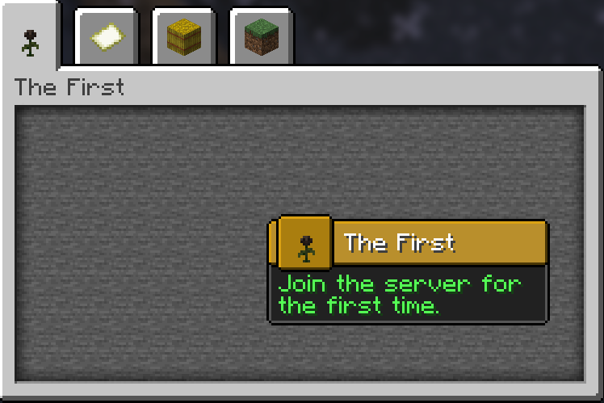

# Creating Your First Advancement
<secondary-label ref="wip"/>
<link-summary>Guide to creating custom advancements with custom rewards and criteria</link-summary>

The Advancement API allows you to add custom advancements to the game. Unlike standard datapack advancements, this API supports custom reward types and criteria directly through your plugin.

### Registering an Advancement {switcher-key="Code"}
To start, you need to set up a dedicated class to hold your advancement registry, similar to item registration.

```Java
public final class Advancements {
    public static final DeferredRegistry<Advancement> ADVANCEMENTS = DeferredRegistry.create(Registries.ADVANCEMENTS, AbyssalLibExample.PLUGIN_ID);
    
    // Registration will be done here
}
```

Next, use the `Advancement.Builder` to create a root advancement. A root advancement acts as the starting point of a new advancement tab.

* **Display:** Configures the visual representation in the GUI, including the icon, title, description, frame type (Task, Goal, Challenge), background, and notification settings.
* **Criterion:** Defines the condition required to unlock the advancement. In this case, `AutoGrantCriterion` unlocks it immediately upon joining the server.

<note>
For a complete list of available criteria and rewards, refer to <a href="default-criterion.md"/> and <a href="default-rewards.md">Default Rewards</a>.
</note>

```Java
public final class Advancements {
    public static final DeferredRegistry<Advancement> ADVANCEMENTS = DeferredRegistry.create(Registries.ADVANCEMENTS, AbyssalLibExample.PLUGIN_ID);

    public static final Advancement ROOT = ADVANCEMENTS.register("root", id -> Advancement.builder(id)
        .display(AdvancementDisplay.builder()
            .icon(new ItemStack(Material.WITHER_ROSE))
            .title(Component.text("The First"))
            .description(Component.text("Join the server for the first time."))
            .frame(AdvancementFrame.TASK)
            .background(Key.key("minecraft", "gui/advancements/backgrounds/stone"))
            .announceToChat(true)
            .showToast(true)
            .build()
        )
        .criterion("auto", new AutoGrantCriterion())
        .build()
    );
}
```

Once you apply the registry in your main class (`Advancements.ADVANCEMENTS.apply()`), you can view the new tab in-game.



To expand the tree, you must set the `parent` of your new advancement to either the root or an existing child advancement. We will also add a custom `ItemReward` that executes when the specific `ItemHasCriterion` is met.

```Java
public static final Advancement GET_DIAMOND = ADVANCEMENTS.register("get_diamond", id -> Advancement.builder(id)
    .parent(ROOT.getId()) // Links this to the root advancement
    .display(AdvancementDisplay.builder()
        .icon(new ItemStack(Material.DIAMOND))
        .title(Component.text("Shiny!"))
        .description(Component.text("Get a diamond for the first time."))
        .frame(AdvancementFrame.GOAL)
        .announceToChat(true)
        .showToast(true)
        .build()
    )
    .criterion("has_diamond", new ItemHasCriterion(ItemPredicate.builder()
        .material(Material.DIAMOND)
        .build())
    )
    .reward(new ItemReward(new ItemStack(Material.EMERALD))) // Grants an Emerald upon completion
    .build()
);
```

When you obtain a diamond in-game, the advancement will trigger and grant the reward.

<video src="../../images/advancement/2.mp4" preview-src="../../images/advancement/2.png"/>

---

### Creating an Advancement {switcher-key="JSON"}
To create an advancement using JSON, create a file at <path>plugins/AbyssalLib/advancements/&lt;namespace&gt;/&lt;id&gt;.json</path>.

For this example, we will make a root advancement at <path>abyssallib_example/root.json</path>. A root advancement acts as the starting point of a new advancement tab.

* **display:** Configures the GUI visuals (icon, parsed MiniMessage description, frame type, and notification settings).
* **criteria:** Defines the condition to unlock the advancement. Here, the `abyssallib:auto_grant` type unlocks it instantly.

<note>
For a complete list of criteria and rewards, refer to <a href="default-criterion.md"/> and <a href="default-rewards.md">Default Rewards</a>.
</note>

```JSON
{
  "display": {
    "title": "The First",
    "description": "<gray>Join the server for the first time.</gray>",
    "icon": {
      "id": "minecraft:wither_rose"
    },
    "frame": "TASK",
    "background": "minecraft:gui/advancements/backgrounds/stone",
    "show_toast": true,
    "announce_to_chat": true,
    "hidden": false
  },
  "criteria": {
    "auto": {
      "type": "abyssallib:auto_grant"
    }
  }
}
```

After saving the file, launch the server to view the advancement in-game.


To add more advancements to this tab, create a new JSON file and define the `parent` key pointing to your root advancement's namespace and ID. We will also utilize the `rewards` array to give the player an item.

```JSON
{
  "parent": "abyssallib_example:root",
  "display": {
    "title": "Shiny!",
    "description": "<gray>Mine your first diamond to earn a reward.</gray>",
    "icon": {
      "id": "minecraft:diamond"
    },
    "frame": "TASK",
    "show_toast": true,
    "announce_to_chat": true,
    "hidden": false
  },
  "criteria": {
    "has_diamond": {
      "type": "abyssallib:has_item",
      "predicate": {
        "type": "DIAMOND"
      }
    }
  },
  "rewards": [
    {
      "type": "abyssallib:item",
      "item": {
        "id": "minecraft:emerald"
      }
    }
  ]
}
```

Save the file and test it in-game. Obtaining a diamond will unlock the advancement and grant the emerald.

<video src="../../images/advancement/2.mp4" preview-src="../../images/advancement/2.png"/>